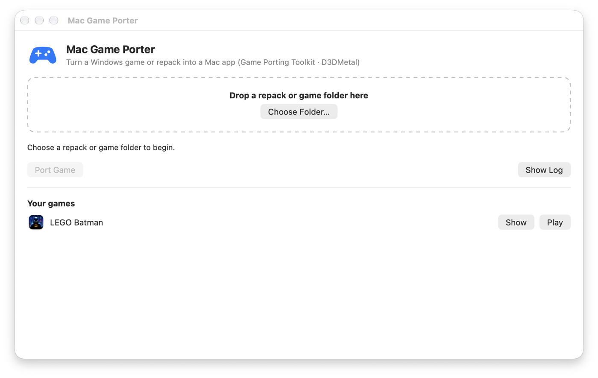

<p align="center"></p>

<h1 align="center">Mac Game Porter</h1>

<p align="center"><b>Play Windows games on your Mac.</b> A free, open-source app that turns Windows games and
repacks into native-feeling macOS apps on Apple Silicon (M1, M2, M3, M4, M5), using Apple's
<b>Game Porting Toolkit</b> and <b>D3DMetal</b> to run DirectX 11 and DirectX 12 games on Metal.</p>

<p align="center">
<a href="LICENSE"></a>


<a href="https://github.com/KarmSakha/mac-game-porter/stargazers"></a>
</p>

<p align="center"></p>

Drop a folder on the window and press **Port Game**. Mac Game Porter works out how to unpack it, sets
up a Windows environment tuned for gaming, and produces a `.app` you launch from Launchpad or the Dock
like any other Mac game. It is a free alternative to CrossOver, Whisky and manual Wine or GPTK setups,
built for people who just want to play.

## Features

- **Play Windows games on Apple Silicon Macs**: DirectX 11 and DirectX 12 through Apple's D3DMetal
  (from the Game Porting Toolkit), plus Wine for everything else.
- **Installs repacks without the Windows installer**: FitGirl-style FreeArc repacks (`setup.exe` +
  `.bin` archives) are extracted natively on macOS. It handles SREP, LZMA, Oodle/xtool recompression,
  `4x4` and CLS plugins, and avoids the installer that stalls in CrossOver and Wine.
- **Or bring an installed game**: point it at a Windows game folder copied from a PC or Steam library.
- **One click, then play**: builds `~/Games/<Game>.app` with an icon; optionally a self-contained **DMG**
  to copy to another Mac.
- **Fits your screen**: borderless fullscreen at your display's exact size, with no overflowing or
  cropped fullscreen window.
- **Faster by default**: MetalFX upscaling for games with DLSS, esync, AVX via Rosetta, and sensible first-run
  graphics presets for Unreal Engine games.
- **Controllers**: PS5 DualSense and Xbox controllers pass through as raw HID, so games can drive
  DualSense features themselves.
- **Doesn't slow your Mac**: extraction runs at low priority, streams data instead of filling your disk,
  and verifies every file.

## Tested games

| Game | Engine / API | Status |
|---|---|---|
| LEGO Batman: Legacy of the Dark Knight | Unreal Engine 5 · DirectX 12 | ✅ Playable on MacBook Air M5 (installed from a 30 GB FreeArc repack) |

Ported another game? Open an issue or PR to add it to this list.

## Mac Game Porter vs. the alternatives

| | Mac Game Porter | CrossOver | Manual Wine / GPTK |
|---|---|---|---|
| Price | Free, open source (MIT) | Paid | Free |
| DirectX 12 via D3DMetal | ✅ | ✅ | ✅ with manual setup |
| Installs FitGirl/FreeArc repacks without running `setup.exe` | ✅ | ❌ | ❌ |
| One `.app` per game, DMG export | ✅ | Partial (bottles) | ❌ |
| Automatic display and fullscreen fixes | ✅ | Partial | ❌ |

## Quick start

### App (recommended)

```sh
git clone https://github.com/KarmSakha/mac-game-porter.git && cd mac-game-porter
brew install innoextract rust mingw-w64
gui/build.sh && cp -R "build/Mac Game Porter.app" ~/Applications/
```

Open **Mac Game Porter**, drop a repack or game folder on the window, check the name, and press
**Port Game**. You get live progress, a log, Cancel, and **Play** when it finishes. Every ported game
is listed under *Your games*.

### Command line

```sh
./porter.sh setup                                                 # one-time: runtimes + native helpers
./porter.sh install "~/Downloads/Some Game [Repack]" --name "Some Game" --dmg
open ~/Games/"Some Game.app"
```

## What `install` does

1. **Extracts the repack natively** (`porter/extract.py`). Each archive's solid blocks are streamed
   through their decoder chain with pipes, so intermediate stages never hit the disk. The decoder for
   every method is chosen from the repack itself (`porter/repack.py`):

   | Method source | How it runs on macOS |
   |---|---|
   | `srep` | native arm64 SREP 3.93 (built from FreeArc source) |
   | FreeArc built-ins (`delta`, `dispack070`, `lzma`, `tornado`, …) | native `fa-filter` |
   | `arc.ini` external with `<stdin> <stdout>` | the repack's Windows tool under Wine, piped |
   | `arc.ini` external using temp files (`$$arcpackedfile$$`, `datafile=`) | Windows tool under Wine on temp files |
   | `xtool` / `rtool` (need a seekable input) | intermediate file in, FIFO out |
   | `cls-<name>.dll` plugins (`magic2`, `lolz`, …) | `clshost.exe` loads the plugin under Wine |
   | `4x4:…:<inner>` | blocks decoded in parallel with the inner stage, written in order |

   Every extracted file is checked against the archive's size table. The repack's own `unarc.dll`
   is never used: it deadlocks under Wine on macOS.
2. **Picks the executable**: Unreal (`*/Binaries/Win64/*-Shipping.exe`, skipping the bootstrap exe that
   hangs under Wine), Unity (`X.exe` next to `X_Data/`), otherwise the largest non-installer exe.
   Override with `--exe`.
3. **Builds `~/Games/<Name>.app`** with GPTK Wine and a tuned prefix template. The game data stays in
   `~/Library/Application Support/MacGamePorter/games/<name>`, outside the bundle: macOS's first-launch
   security scan of a 40 GB bundle blocks the launch for minutes. `--dmg` builds a self-contained app
   (game embedded) in a compressed DMG for another Mac.

## What the generated app does on launch

- Copies the prefix to `~/Library/Application Support/<Name>/prefix` on first run, so the app can run
  from a read-only DMG. Saves live there too.
- **Display**: Wine Retina mode off and borderless fullscreen at the exact screen size in points.
  This avoids the "window overflows the screen" problem and exclusive-mode switches macOS can't do.
  Unreal `GameUserSettings.ini` is corrected on every launch; Unity gets `-window-mode borderless`.
- **Performance**: `D3DM_ENABLE_METALFX=1` (DLSS upscaling requests go to MetalFX, where the game offers
  DLSS), esync, and the Unreal first-run Epic preset is lowered to High. Rosetta advertises AVX.
- **Controllers**: Wine's SDL backend is off, so pads appear as raw HID devices and games can send their
  own DualSense output reports (adaptive triggers). Use a USB-C cable: DualSense haptics are
  4-channel USB audio and don't work over Bluetooth.

Per-user tweaks go in `~/Library/Application Support/<Name>/launch.conf`, for example:

```sh
MTL_HUD_ENABLED=1        # Metal FPS overlay
EXTRA_ARGS="-dx12"       # extra game arguments
```

Logs are written to `~/Library/Application Support/<Name>/last-run.log`.

## Requirements

Apple Silicon Mac on macOS 14 or later, Xcode command line tools, and Homebrew packages
`innoextract rust mingw-w64` (`native/build.sh` checks for them). Runtimes are downloaded on first use and
verified by SHA-256:
[Wine Staging 11.18](https://github.com/Gcenx/macOS_Wine_builds) for the decoders and
[Game Porting Toolkit 3.0](https://github.com/Gcenx/game-porting-toolkit) for games.
Data and caches live in `~/Library/Application Support/MacGamePorter`.

## Layout

```
porter.sh              entry point
gui/                   SwiftUI app (MacGamePorter.swift), its build script and icon renderer
porter/cli.py          setup / install / extract / package commands
porter/repack.py       repack detection, payload extraction (innoextract), arc.ini → decoder plan
porter/extract.py      streaming extractor and verification
porter/stagerun.py     header / temp-file / 4x4 stage runner
porter/game.py         engine and executable detection
porter/package.py      prefix template, .app and DMG
templates/launcher.sh  launcher copied into every app
native/                fa-filter, SREP patch, CLS host, FreeArc archive mapper (vendored, MIT)
```


## FAQ

### How do I play Windows games on a Mac with Apple Silicon?
Install Mac Game Porter, drop the game folder (or repack) on it, and press **Port Game**. It uses
Apple's Game Porting Toolkit (Wine + D3DMetal) under the hood, so DirectX 11/12 games render on Metal.

### How do I install a FitGirl repack on a Mac?
FitGirl-style repacks ship a Windows `setup.exe` whose unpacker stalls under CrossOver and Wine on macOS.
Mac Game Porter skips it: it reads the repack's own decoder list and unpacks the `.bin` archives natively,
then turns the game into a Mac app. Only install games you own.

### Is this a free CrossOver or Whisky alternative?
Yes. It is free and open source, and uses the same underlying technology (Wine and Apple's D3DMetal).
It produces one standalone app per game instead of bottles.

### Can I run DirectX 12 games on a Mac?
Yes. Apple's D3DMetal (part of the Game Porting Toolkit) translates DirectX 12 to Metal, and Mac Game
Porter sets it up automatically. How well a game runs depends on the game and your Mac.

### Does my PS5 DualSense controller work?
Controllers are passed through as raw HID devices so games can talk to them directly. Connect the
DualSense with a USB-C cable for the best support; haptic feedback requires USB.

### Which Macs are supported?
Apple Silicon Macs (M1, M2, M3, M4, M5) on macOS 14 Sonoma or later. Intel Macs are not supported
because D3DMetal requires Apple Silicon.

### The game window is too big for my screen / overflows fullscreen?
Apps made by Mac Game Porter launch in borderless fullscreen at your screen's exact size in points, which
fixes the overflowing-window problem common with Wine on Retina displays.

### How do I improve FPS?
Pick DLSS in the game's graphics menu if it's offered (it's mapped to Apple MetalFX), lower the preset,
or turn on the Metal HUD (`MTL_HUD_ENABLED=1` in `launch.conf`) to measure.

## Notes

- Nothing proprietary is stored in this repo: Apple's D3DMetal comes with the GPTK download, and
  repack decoders are taken from the repack being installed.
- Only install games you are entitled to.
- The repack's stored checksums use a non-standard format, so verification checks sizes and
  structure, not CRC32.
